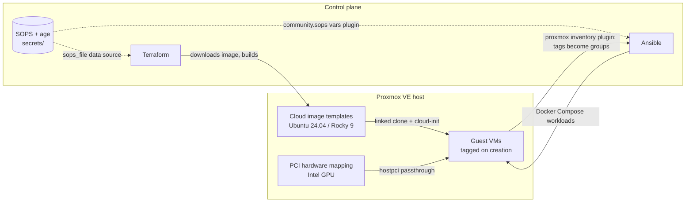
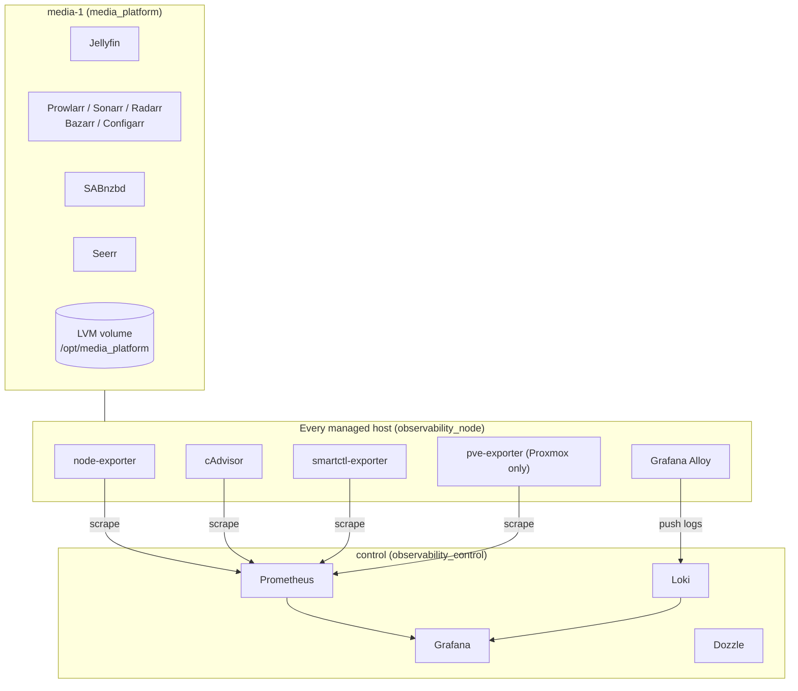

# Homelab Infrastructure

[](https://github.com/RashunB/Homelab-Infra/actions/workflows/ci.yml)
[](https://developer.hashicorp.com/terraform)
[](https://docs.ansible.com/)
[](https://www.proxmox.com/)
[](https://github.com/getsops/sops)

A fully declarative, GitOps-style homelab platform. Terraform provisions virtual
machines on Proxmox VE, Ansible configures them, and the handoff between the two
is driven by dynamic inventory rather than hardcoded hosts. Every change is
linted, validated, security-scanned, and secret-scanned in CI before it merges.

> **In one sentence:** bare metal to a running, monitored, GPU-accelerated
> application stack with two commands and zero plaintext secrets in git.

---

## Highlights

| | |
|---|---|
| **Provisioning** | Terraform against the Proxmox VE API, layered into a shared base, a reusable VM module, and per-deployment stacks |
| **Configuration** | Ansible with 7 first-party roles, all validated by `argument_specs` |
| **Inventory** | Dynamic, from live Proxmox tags. Terraform writes the tags, Ansible reads them. No host list to maintain |
| **Secrets** | SOPS with `age`, consumed natively by both Terraform (provider) and Ansible (vars plugin) |
| **Observability** | Prometheus, Loki, Grafana, Alloy, cAdvisor, node/smartctl/PVE exporters, hub-and-spoke across every host |
| **Hardware** | Intel GPU passed through to the VM via PCI hardware mapping for VA-API transcoding |
| **Quality gates** | 8 CI jobs plus a pre-commit suite: lint, format, validate, IaC misconfiguration scan, full-history secret scan |

---

## Architecture

### Provisioning flow



### Runtime topology



---

## Repository layout

```
.
├── workspace/                  # Terraform  ->  see workspace/README.md
│   ├── modules/proxmox_vm/     #   reusable VM module (cloud-init, disks, PCI passthrough)
│   ├── infrastructure/_base/   #   shared, long-lived: OS templates, GPU hardware mapping
│   └── deployments/media/
│       ├── infrastructure/     #   the media VM + Cloudflare DNS record
│       └── application/        #   *arr application config as code (post-Ansible)
│
├── ansible/                    # Ansible  ->  see ansible/README.md
│   ├── inventory/              #   layered: dynamic Proxmox plugin + static overlays
│   ├── roles/                  #   7 first-party roles + 2 vendored
│   ├── template_role/          #   galaxy skeleton enforcing the repo's role conventions
│   └── site.yml                #   top-level entry point
│
├── secrets/                    # SOPS-encrypted, age-recipient controlled
├── .github/workflows/ci.yml    # 8 quality gates
├── .pre-commit-config.yaml     # the same gates, locally, before you push
└── trivy.yaml / .ansible-lint / .yamllint
```

The two halves are documented separately because they solve different problems
and have different lifecycles:

- **[`workspace/README.md`](workspace/README.md)** covers provisioning: state,
  stack layering, the module contract, and GPU passthrough.
- **[`ansible/README.md`](ansible/README.md)** covers configuration: inventory
  composition, the role catalog, variable conventions, and secret injection.

---

## Quickstart

### Prerequisites

| Tool | Notes |
|---|---|
| Terraform `>= 1.15` | Pinned provider versions, lockfiles committed |
| `ansible-core` | Collections installed from `ansible/requirements.yml` |
| `sops` + `age` | You need the private key matching the recipient in `.sops.yaml` |
| Proxmox VE | API token for Terraform, a second token for Ansible inventory |
| `pre-commit` | Optional locally, enforced in CI |

Tooling installers for the Terraform-side binaries (trivy, terraform-docs,
tflint) are collected in [`terraform_precommit.txt`](terraform_precommit.txt).

### 1. Decrypt-capable environment

```bash
export SOPS_AGE_KEY_FILE=~/.config/sops/age/keys.txt
sops -d secrets/pve.sops.yaml >/dev/null   # smoke test
```

### 2. Build the shared base (once)

```bash
terraform -chdir=workspace/infrastructure/_base init
terraform -chdir=workspace/infrastructure/_base apply
```

This downloads the Ubuntu 24.04 and Rocky 9 cloud images, converts them into
Proxmox templates, and registers the GPU hardware mapping. Both templates carry
`prevent_destroy`.

### 3. Provision a deployment

```bash
terraform -chdir=workspace/deployments/media/infrastructure init
terraform -chdir=workspace/deployments/media/infrastructure apply
```

### 4. Configure everything

```bash
cd ansible
ansible-galaxy install -r requirements.yml
ansible-playbook site.yml
```

No inventory file needs editing to make the new VM reachable: Terraform tagged it,
the Proxmox inventory plugin discovers it and turns its tags into groups, and it
joins the monitored fleet through group children. Static overlays in
`ansible/inventory/` assign it to a specific workload group.

### 5. Apply application-level config

```bash
terraform -chdir=workspace/deployments/media/application init
terraform -chdir=workspace/deployments/media/application apply
```

Runs last by design, because it configures services that Ansible has to have
started first.

---

## Quality gates

Every push and pull request runs these. The same checks are available locally
through `pre-commit run --all-files`.

| Job | What it protects |
|---|---|
| `ansible-lint` | Role and playbook correctness, idempotency smells, FQCN usage |
| `yaml-lint` | YAML style across the whole repo |
| `terraform-static` | `terraform fmt -check -recursive` plus recursive TFLint |
| `terraform-validate` | Matrix `init -backend=false` + `validate` across all three stacks |
| `trivy` | IaC misconfiguration scanning of `workspace/` |
| `gitleaks` | Secret scanning across the **full git history**, not just the diff |
| `actionlint` | The workflow files themselves |
| `hooks` | Whitespace/EOF hygiene, private key detection, verifies every `*.sops.yaml` is actually encrypted |

All third-party actions are pinned to commit SHAs rather than tags.

---

## Secrets management

No plaintext secret is ever committed. `.sops.yaml` binds every `*.sops.yaml`
file in the repo to a single `age` recipient, and both tools read the encrypted
files directly, so there is no decrypt-to-disk step and no `.env` to leak.

```
secrets/
├── pve.sops.yaml              # Proxmox API tokens (terraform, ansible, prometheus: one each)
├── proxmox_id.sops.yaml       # SSH key Terraform uses against the PVE node
├── ansible_id.sops.yaml       # SSH keypair seeded into guests via cloud-init
├── cloudflare.sops.yaml       # Cloudflare API token + zone ID
└── media_platform.sops.yaml   # Application API keys and service credentials
```

- **Terraform** reads them with the `carlpett/sops` provider as a `sops_file` data source.
- **Ansible** reads them with the `community.sops` vars plugin and lookup, wired
  in through symlinks under `inventory/group_vars/`.
- **CI** enforces it: the `sops` pre-commit hook fails on any unencrypted
  `*.sops.yaml`, `detect-private-key` blocks stray keys, and `gitleaks` audits
  the entire history.

Separate API tokens per consumer keeps blast radius small and makes credential
rotation a one-file change.

---

## Engineering decisions

Notes on the choices that were not obvious, and what the alternatives cost.

**Terraform provisions, Ansible configures, and neither reaches into the other.**
No `local-exec` calling `ansible-playbook`, no Ansible module creating VMs. The
seam between them is Proxmox VM tags. Terraform's `vm_tag_list` becomes a
`keyed_groups` entry in the inventory plugin, which becomes a playbook target.
Adding a host to a role is a tag change, not an inventory edit, and the two
tools keep independent state.

**Templates are discovered by tag, not by ID.** The `proxmox_vm` module queries
`proxmox_virtual_environment_vms` filtered on `["template", var.template_os_tag]`
instead of accepting a VM ID. Rebuilding a template does not require touching a
single deployment stack.

**`infrastructure` and `application` are separate stacks per deployment.** They
have genuinely different dependency graphs: the infrastructure stack talks to
Proxmox and Cloudflare, the application stack talks to service APIs that only
exist after Ansible has started the containers. Splitting them keeps a failed
application apply from blocking a VM rebuild, and keeps plan times honest.

**Two Proxmox provider aliases.** The default alias uses a scoped API token;
the `root` alias uses username/password. VM cloning and template creation
require privileges the API token cannot hold, so the elevated credential is
confined to exactly the resources that need it rather than being used repo-wide.

**GPU passthrough flips the machine type automatically.** `pcie_devices` being
non-empty switches the VM to `q35` + `ovmf` and attaches an EFI disk, because
PCIe passthrough does not work on the `i440fx` + SeaBIOS default. One variable,
no room to get the combination wrong.

**Every first-party role ships `meta/argument_specs.yml`.** Bad input fails at
role entry with a typed error instead of halfway through a play. This is also
why `lvm_storage` can safely accept a nested list-of-dicts describing entire
volume groups.

**Role variables are namespaced and re-exported.** Role defaults are prefixed
(`media_platform_*`, `observability_node_*`), and `group_vars` maps shared
values onto them. One place to change a port, no collisions between roles.

---

## Known gaps and roadmap

Deliberately listed. These are the things a reviewer would ask about.

- [ ] **Remote state.** Terraform state is currently local. Migrating to a
      locking backend is the highest-value next change, and the prerequisite
      for running `apply` from CI.
- [ ] **CI is plan-only.** Workflows validate and scan but never apply. Automated
      `plan` output on pull requests is the next step.
- [ ] **Role documentation.** Role `README.md` files are still galaxy skeleton
      boilerplate. The `argument_specs.yml` files are the accurate reference
      until those are written.
- [ ] **No test harness.** Molecule scenarios for the first-party roles, plus
      `terraform test` for the module, would close the loop.
- [ ] **TLS.** Proxmox providers run with `insecure = true` against the lab CA,
      and services are served over plain HTTP behind the LAN boundary.
- [ ] **Re-enable the full pre-commit CI job** and the `terraform-docs` diff
      check, both currently commented out in `ci.yml` (the docs action generates
      output that does not match local runs).
- [ ] **Backups.** No automated backup or restore path for application state or
      Terraform state yet.

---

## License

Personal project. No license granted; see the repository owner.
