# GPU Passthrough (Intel VA-API)

> [!info] Scope
> End-to-end trace of how the Intel GPU gets from a physical PCI slot on the
> Proxmox host into a running Jellyfin container, across all three layers:
> Proxmox hardware mapping, Terraform VM config, and the Ansible
> `media_platform` role.

## The mechanism has four distinct hops

```mermaid
flowchart LR
    subgraph PVE["Proxmox host"]
        PHYS["Physical GPU<br/>PCI 0000:03:00.0, id 8086:56a5<br/>IOMMU group 15"]
        MAP["proxmox_hardware_mapping_pci<br/>'transcoding_gpu'<br/>(defined once, in _base)"]
    end

    subgraph TF["Terraform (deployments/media/infrastructure)"]
        DS["data.proxmox_hardware_mapping_pci<br/>looked up, not redefined"]
        PCIE["local.pcie_devices map<br/>{hostpci0 = {mapping='transcoding_gpu'}}"]
        MODVAR["module.media_vm<br/>pcie_devices = local.pcie_devices"]
    end

    subgraph MOD["modules/proxmox_vm"]
        SWITCH["gpu_passthrough = length(pcie_devices) > 0"]
        MTYPE["machine=q35, bios=ovmf<br/>+ efi_disk block"]
        HOSTPCI["dynamic hostpci block<br/>on the VM resource"]
    end

    subgraph VM["Guest VM"]
        DRI["/dev/dri/renderD128<br/>exposed to guest OS"]
    end

    subgraph ANS["Ansible: media_platform role"]
        DRIVERS["gpu.yml: intel-media-va-driver-non-free,<br/>vainfo, intel-gpu-tools, video/render groups"]
        MOUNT["docker-compose.yml.j2: jellyfin<br/>devices: /dev/dri/renderD128"]
    end

    PHYS --> MAP --> DS --> PCIE --> MODVAR --> SWITCH
    SWITCH --> MTYPE
    SWITCH --> HOSTPCI --> DRI
    DRI --> DRIVERS --> MOUNT

    classDef proxmox fill:#E57000,color:#fff,stroke:#b35800
    classDef tf fill:#7B42BC,color:#fff,stroke:#5a2f8f
    classDef ans fill:#0969da,color:#fff,stroke:#0550ae
    class PHYS,MAP proxmox
    class DS,PCIE,MODVAR,SWITCH,MTYPE,HOSTPCI tf
    class DRI,DRIVERS,MOUNT ans
```



Getting VA-API transcoding to actually work requires all four hops to be
correct simultaneously. Missing any one leaves you with a VM that boots fine
but a Jellyfin that falls back to software transcoding with no obvious error
pointing at *why*.

## Hop 1: the Proxmox-side hardware mapping (defined once)

```hcl
resource "proxmox_hardware_mapping_pci" "transcoding_gpu" {
  name = "transcoding_gpu"
  map = [
    {
      comment      = "GPU specific for media transcoding"
      node         = "pve"
      id           = "8086:56a5"
      iommu_group  = 15
      path         = "0000:03:00.0"
      subsystem_id = "1849:6004"
    },
  ]
}
```
(`workspace/infrastructure/_base/main-gpu.tf`, full file)

This is a **cluster-scoped** Proxmox resource — a named hardware mapping,
not a per-VM setting. It's defined exactly once, in `_base`, and identifies
the physical device by PCI vendor:device ID (`8086:56a5` — Intel), bus path,
IOMMU group, and subsystem ID, all specific to this one physical machine's
GPU. If you ever move this homelab to different hardware, this resource
(and only this resource) needs new values.

> [!warning] Every field here is hand-specified for this one physical host
> `node = "pve"`, `path = "0000:03:00.0"`, `iommu_group = 15` — none of these
> are computed or discovered by Terraform. They were presumably read off the
> actual Proxmox host (`lspci`, `/sys/kernel/iommu_groups/`) once and typed
> in. There's no drift detection if the physical hardware ever changes slot
> or the host's IOMMU grouping shifts after a BIOS/kernel update.

## Hop 2: Terraform reads the mapping as data, builds the module input

`deployments/media/infrastructure/main.tf` never redefines the mapping — it
looks it up:

```hcl
data "proxmox_hardware_mapping_pci" "transcoding_gpu" {
  name = "transcoding_gpu"
}

locals {
  pcie_map = [data.proxmox_hardware_mapping_pci.transcoding_gpu.name]
  pcie_devices = {
    for idx, name in local.pcie_map : "hostpci${idx}" => {
      device  = "hostpci${idx}"
      mapping = name
      pcie    = true
    }
  }
}
```
(`main.tf:5-23`)

This is the pattern documented in [[engineering-decisions]] and
[[provisioning]]: shared, cluster-scoped resources are *defined* in `_base`
and *read* everywhere else, so a deployment stack never owns (and can't
accidentally destroy) a cluster resource. `pcie_devices` ends up as a
one-entry map, `{"hostpci0" = {device="hostpci0", mapping="transcoding_gpu",
pcie=true}}`, which is passed straight through to the module:

```hcl
module "media_vm" {
  ...
  pcie_devices = local.pcie_devices
}
```
(`main.tf:44`)

## Hop 3: the module's single-variable switch

Inside `modules/proxmox_vm/main.tf`:

```hcl
gpu_passthrough = length(var.pcie_devices) > 0
```
```hcl
machine = local.gpu_passthrough ? "q35" : "pc"
bios    = local.gpu_passthrough ? "ovmf" : "seabios"
```
```hcl
dynamic "efi_disk" {
  for_each = local.gpu_passthrough ? [1] : []
  content {
    datastore_id = var.datastore_infra
    file_format  = "raw"
    type         = "4m"
  }
}
```
```hcl
dynamic "hostpci" {
  for_each = var.pcie_devices
  content {
    device  = hostpci.value["device"]
    mapping = hostpci.value["mapping"]
    pcie    = hostpci.value["pcie"]
    rombar  = hostpci.value["pcie"]
  }
}
```
(`main.tf:23`, `:52-53`, `:76-93`)

One caller-facing decision — "is `pcie_devices` non-empty?" — deterministically
produces three coupled outcomes: `q35` machine type, OVMF/UEFI BIOS, and an
EFI disk. This is intentional per [[engineering-decisions]]: PCIe passthrough
does not function on `i440fx` + SeaBIOS, so there is no way, through this
module's interface, to end up with a passthrough VM on the wrong machine
type — you either get all three or none.

> [!bug] `rombar` is coupled to `pcie`, not independently controlled
> Look closely at the `hostpci` block: `rombar = hostpci.value["pcie"]`.
> `rombar` (ROM BAR exposure to the guest) and `pcie` (PCIe vs. legacy PCI
> bus) are unrelated Proxmox settings that happen to both default `true`
> here. There is currently no way to pass a device with `pcie = true` but
> `rombar = false` through this module — they're forced to move together.
> Harmless today with one GPU always at `pcie: true`, but worth knowing if
> you ever add a device that needs `rombar` off. See [[provisioning]] for
> the same finding in context.

## Hop 4: what the guest OS and container still need — this is the part that's easy to forget

Passing the PCI device through gets you a `/dev/dri/renderD128` node
*available inside the VM's kernel* — assuming the guest kernel has the right
driver. It does **not** get you a working Jellyfin transcode by itself. Three
more things have to happen, all inside the `media_platform` Ansible role,
none of them visible from the Terraform side at all:

### 1. Guest-OS driver packages (`roles/media_platform/tasks/gpu.yml`)

```yaml
- name: Esure GPU packages are installed
  ansible.builtin.apt:
    name: ["linux-modules-extra-{{ ansible_kernel }}"]
  notify: Reboot

- name: Esure GPU/Transcoding tools packages are installed
  ansible.builtin.apt:
    name:
      - linux-firmware
      - intel-gpu-tools
      - vainfo
      - intel-media-va-driver-non-free

- name: Ensure Media User GPU groups
  ansible.builtin.user:
    name: "{{ media_platform_user }}"
    groups: [video, render]
    append: true

- name: Reboot if needed
  ansible.builtin.meta: flush_handlers
```

`linux-modules-extra-{{ ansible_kernel }}` supplies kernel modules not in the
base kernel package — installing it queues a reboot, and `gpu.yml` **forces
that reboot to happen immediately** via `meta: flush_handlers`, rather than
letting Ansible's normal end-of-play handler timing defer it (see
[[configuration]]). This matters specifically because `compose.yml` — the
very next task file in `media_platform`'s `tasks/main.yml` — starts
containers that mount `/dev/dri/renderD128`; if the reboot were deferred to
end-of-play, the freshly loaded kernel modules might not be active yet when
Jellyfin starts.

`intel-media-va-driver-non-free` is specifically the **non-free** iHD driver
package — the open-source `intel-media-va-driver` (without `-non-free`)
doesn't support newer Intel hardware acceleration features. This is a
deliberate package choice, not the Debian/Ubuntu default.

The `media` service user is added to the host's `video` and `render` groups
— **without this, the container's device access would fail at the OS
permission layer even with the PCI passthrough and the device node both
present**, because `/dev/dri/renderD128` is group-owned and containers
inherit host-level device permissions through the bind mount.

### 2. Container-level device mount and env vars (`docker-compose.yml.j2`)

```yaml
jellyfin:
  environment:
    DOCKER_MODS: "linuxserver/mods:jellyfin-opencl-intel"
    NEOReadDebugKeys: "1"
    OverrideGpuAddressSpace: "48"
  devices:
    - /dev/dri/renderD128:/dev/dri/renderD128
```
(`roles/media_platform/templates/docker-compose.yml.j2:7-24`)

Three more Intel-specific details, easy to miss:

- `DOCKER_MODS: linuxserver/mods:jellyfin-opencl-intel` pulls in Intel's
  OpenCL runtime at container start — needed for Jellyfin's hardware
  tonemapping/OpenCL-based features, separate from the VA-API path used for
  basic hardware decode/encode.
- `NEOReadDebugKeys` and `OverrideGpuAddressSpace` are known environment-variable
  workarounds for Intel's `neo` (compute-runtime) driver stack running
  inside a container on certain iGPU generations — without these, some
  Intel GPUs report the wrong addressable memory space to the driver and
  hardware acceleration silently fails or crashes.
- Only `/dev/dri/renderD128` is mounted — not the whole `/dev/dri` directory,
  not `/dev/dri/card0`. `renderD128` is the render-only node; Jellyfin
  doesn't need (and in a headless container context shouldn't have) the
  display-capable `card0` node.

### 3. `vainfo` and `intel-gpu-tools` are diagnostic, not functional dependencies

They're installed on the host, not inside the container. If transcoding ever
stops working, `vainfo` run on the **host** (not in the container) is the
first thing to check — it confirms whether the VA-API driver stack sees the
device at all, independent of anything Docker or Jellyfin are doing.

## Check your understanding

- [ ] Name all four layers a GPU frame's "access path" passes through, from
      the physical PCI device to a Jellyfin transcode actually happening.
- [ ] Which Terraform resource is cluster-scoped and defined exactly once,
      and which stack merely reads it as a data source?
- [ ] What three VM properties flip together when `pcie_devices` becomes
      non-empty, and why can't PCIe passthrough work without that coupling?
- [ ] Why does `gpu.yml` force an immediate reboot instead of letting the
      handler fire normally at the end of the play?
- [ ] Why is `intel-media-va-driver-non-free` specifically required instead
      of the driver package Ubuntu installs by default?
- [ ] If Jellyfin's container can see `/dev/dri/renderD128` but transcoding
      still fails, what host-level group membership would you check first,
      and why would it matter even though the device node exists?
- [ ] What does `rombar` control on the `hostpci` Terraform block, and why
      is it currently unable to be set independently of `pcie` in this
      module?
