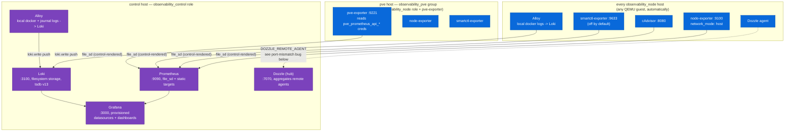

# Observability Stack

> [!info] Scope
> Deep dive into `ansible/roles/observability_control` and
> `observability_node` — the actual scrape topology, the log path, and the
> host-joins-monitoring mechanism. The root README's runtime-topology diagram
> is the map; this note is the territory underneath it.

## Control vs. node-local, concretely



`observability_control` runs on `control` (192.168.0.60) only.
`observability_node` runs on every host in that group — which, per
[[configuration]], is every QEMU guest automatically plus the two hosts
statically listed under `observability_pve`/`observability` in
`10_observability.ini`.

## What each exporter actually scrapes

Read the actual compose templates, not just the README's exporter list:

| Exporter | Where it runs | What it reads | Enabled by default? |
|---|---|---|---|
| `node-exporter` | Every `observability_node` host, `network_mode: host` | Host `/proc`, `/sys`, root filesystem (`--path.rootfs=/host` etc., `roles/observability_node/templates/docker-compose.yml.j2:7-22`) | Yes |
| `cAdvisor` | Every `observability_node` host | Container-level metrics via `/rootfs`, `/var/run`, `/sys`, `/var/lib/docker` bind mounts (`:48-64`) | Yes |
| `smartctl-exporter` | Every `observability_node` host | **Hardcoded** device list: `/dev/sda`, `/dev/sdb`, `/dev/sdc`, `/dev/sdd`, `/dev/nvme0` (`:36-41`) | **No** — gated by `observability_node_smartctl_exporter_enabled`, `false` by default |
| `pve-exporter` | Proxmox host only, via `observability_node_pve_exporter_enabled` | Proxmox API, using the *third* credential in `pve.sops.yaml` (`pve_prometheus_api_*` — see [[secrets]]) | **No** by default; flipped on specifically for `observability_pve` in `group_vars/observability_pve:3` |
| `Alloy` | Every host (control + node) | Docker socket (`discovery.docker`) for container logs, plus optionally the systemd journal | Docker logs: yes. Journal: `observability_node_alloy_journal_enabled` — `false` by default, `true` for the PVE host specifically |

> [!bug] `smartctl-exporter`'s device list is not host-aware
> `/dev/sda` through `/dev/sdd` plus `/dev/nvme0` are **literal, hardcoded**
> device paths in both `observability_node/templates/docker-compose.yml.j2:36-41`
> and the control-side equivalent (which only mounts `/dev/nvme0`,
> `observability_control/templates/docker-compose.yml.j2:57-58`). Nothing
> derives this from `ansible_devices` facts. A host without exactly that disk
> layout either silently doesn't get metrics for its real disks, or Docker
> fails to start the container over a missing device mount — depending on
> Docker's exact behavior for a nonexistent `--device`. If you add a host
> with different storage, this template needs a manual edit.

> [!bug] `observability_pve` group_vars enables `pve_exporter_enabled` — the exporter that scrapes what?
> `group_vars/observability_pve` sets three booleans, and
> `pve_exporter_enabled: true` is one of them. This is the correct place for
> it — only the Proxmox host itself can supply PVE API-adjacent metrics — but
> it's easy to misread `pve_exporter` as a generic "Proxmox metrics" service
> that could run anywhere; it specifically means "run
> `prometheus-pve-exporter` against the local PVE API" and only makes sense
> on the `pve` host.

## Prometheus target discovery: file_sd, not live discovery

`observability_control`'s `prometheus.yml.j2` mixes two patterns:

```yaml
- job_name: Control Node-Exporter
  static_configs:
    - targets: ["host.docker.internal:{{ observability_control_node_exporter_host_port }}"]
# ...
- job_name: Node Node-Exporter
  file_sd_configs:
    - files: ["/etc/prometheus/file_sd/node_exporter.yml"]
      refresh_interval: 30s
```
(`roles/observability_control/templates/prometheus/prometheus.yml.j2`, full
file)

Control-local exporters are `static_configs` (fixed at render time — there's
only one control host, so this is fine). Every **node** exporter is
discovered via `file_sd_configs` pointing at four Jinja-rendered YAML files
under `/etc/prometheus/file_sd/` — one per exporter type
(`node_exporter.yml.j2`, `cadvisor.yml.j2`, `smartctl_exporter.yml.j2`,
`pve_exporter.yml.j2`), each built by looping
`` over Ansible's inventory
(`roles/observability_control/tasks/prometheus.yml:15-24`).

> [!warning] The target list is only as fresh as the last `observability_control` run
> Prometheus itself re-reads these files every 30 seconds
> (`refresh_interval: 30s`), so within Prometheus that part *is* live. But
> the **file contents** are static output from an Ansible template render —
> they only change when the `observability_control` role runs again against
> the control host. A newly provisioned VM that lands in `observability_node`
> (automatically, via `proxmox_all_qemu` — see [[configuration]]) is not
> scraped until `ansible-playbook site.yml --tags observability` (or
> equivalent) is re-run against the control host, which regenerates these
> four files. Tag-based auto-join gets a host *eligible* for the inventory
> group; it does not, by itself, get the host into Prometheus's live scrape
> list.

> [!bug] Three of the four `file_sd` templates have a missing closing quote
> `node_exporter.yml.j2`, `pve_exporter.yml.j2`, and `cadvisor.yml.j2` all
> render:
> ```
> - targets:
>     - "{{ hostvars[host].ansible_host }}:{{ hostvars[host].observability_node_pve_exporter_host_port }}
>   labels:
> ```
> — note the missing closing `"` after the port variable
> (`roles/observability_control/templates/prometheus/file_sd/{node_exporter,pve_exporter,cadvisor}.yml.j2`).
> This produces syntactically invalid YAML for the `targets` list entry.
> `smartctl_exporter.yml.j2` has the same missing quote. **All four
> templates also reference `observability_node_pve_exporter_host_port`
> regardless of which exporter they're supposedly targeting** —
> `cadvisor.yml.j2` and `smartctl_exporter.yml.j2` both point at the
> PVE-exporter's port variable, not `cadvisor_host_port` or
> `smartctl_exporter_host_port`. Read the four files yourself
> (`roles/observability_control/templates/prometheus/file_sd/*.yml.j2`) —
> this looks like a copy-paste-and-forget-to-rename bug across every
> `file_sd` target file except (possibly) the one it was originally written
> for. Given `pve_exporter` is disabled by default and `cadvisor`/`node_exporter`
> jobs are, in practice, probably being fed a malformed or wrong-port target
> list, this is worth verifying against what Grafana is actually showing for
> node-level dashboards before trusting them.

## The log path: Alloy → Loki

Every host (control and node) runs Grafana Alloy, configured near-identically
(`roles/observability_control/templates/alloy/alloy-config.yml.j2` and the
node equivalent are line-for-line the same structure):

```
discovery.docker "docker_scrape" { host = "unix:///var/run/docker.sock" ... }
discovery.relabel "docker_scrape" { ... container name -> "container" label ... }
loki.source.docker "docker_scrape" { targets = ...; forward_to = [loki.write.default.receiver] }
loki.write "default" { endpoint { url = "{{ ..._loki_remote_url }}" } }
```

Every host's Alloy instance pushes **directly** to the control host's Loki
(`loki_remote_url: http://{{ control_host_ip }}:{{ loki_host_port }}/loki/api/v1/push`,
`group_vars/observability:23-24`) — there's no local buffering tier, no
per-node Loki, just a push straight across the LAN. Journal-log collection
(`loki.source.journal`) is conditional on
`{alloy_role}_alloy_journal_enabled`, off everywhere except the PVE host.

Loki itself runs single-node, filesystem-backed, `inmemory` ring
(`loki-config.yml.j2:8-18`) — no replication, no object storage. Consistent
with homelab scale; would need a real rework (not a config flag) to run
Loki HA.

## Dozzle: control hub, per-node agents

Every node runs a Dozzle **agent** (`command: agent`,
`observability_node/templates/docker-compose.yml.j2:66-86`). The control
host runs a full Dozzle instance that's told which remote agents to connect
to via an env file rendered per-host:

```
DOZZLE_REMOTE_AGENT={{ hostvars[host].ansible_host }}:{{ observability_control_dozzle_host_port }}|{{ host }},...
```
(`roles/observability_control/templates/dozzle/dozzle.env.j2`, full file)

> [!bug] Dozzle's remote-agent port is wrong by default
> That template builds each remote agent's address using
> **`observability_control_dozzle_host_port`** — the *control* role's own
> Dozzle port variable (default `7070`,
> `roles/observability_control/defaults/main.yml:16`) — for every node in
> `groups['observability_node']`. But each node's actual Dozzle agent is
> published on **`observability_node_dozzle_host_port`**, which defaults to
> **`7007`** (`roles/observability_node/defaults/main.yml:14`) — a different
> port number, not just a different variable name. Unless every node happens
> to have its `observability_node_dozzle_host_port` explicitly overridden to
> match the control host's port, `DOZZLE_REMOTE_AGENT` points at the wrong
> port and the control Dozzle instance cannot reach the node's agent. Check
> `docker logs dozzle` on the control host if remote-agent tiles ever show
> as unreachable — this is very likely why.

## How a newly provisioned host joins monitoring — precisely

1. Terraform's `proxmox_vm` module tags the new VM (default `["terraform"]`
   plus whatever the deployment passed — see [[provisioning]]). This makes
   the VM a QEMU guest, full stop; no monitoring-specific tag is required.
2. Ansible's dynamic inventory plugin discovers it on the next inventory
   parse (`community.proxmox.proxmox`, `want_facts: true`).
3. Because it's a QEMU guest, it's automatically a member of the implicit
   `proxmox_all_qemu` group, which `10_observability.ini` wires into
   `observability_node:children` — **no Ansible file edit required for this
   step**.
4. It is **not** scraped by Prometheus, aggregated by the control Dozzle, or
   receiving log config until the `observability_control` role is run again
   against the control host (to regenerate the `file_sd` target files and
   the Dozzle env file) **and** the `observability_node` role is run against
   the new host itself (to actually start its exporters and Alloy).
5. Running `ansible-playbook site.yml` (which touches both
   `observability_control.yml` and `observability_node.yml` in order, per
   `site.yml`) satisfies both halves in one invocation.

So: tag-driven inventory membership is genuinely automatic. Actually being
monitored still requires an Ansible run touching both the control host and
the new node — it is not a fire-and-forget consequence of `terraform apply`
alone.

## Duplicate-looking Grafana dashboards

`roles/observability_control/files/grafana/provisioning/dashboards/` contains
both `media-server.json` and `Media Server.json` (confirmed via directory
listing) alongside `container.json`, `server.json`, `storage.json`,
`thermals.json`, and `provider.yml`. Grafana's file provisioner
(`foldersFromFilesStructure: true`, `provider.yml:7`) will load both as
separate dashboards. Whether this is an intentional pair or a leftover
duplicate from a rename isn't determinable from the file contents alone —
worth checking in Grafana directly next time you're in there.

## Check your understanding

- [ ] Walk through, step by step, what happens between `terraform apply`
      creating a new VM and that VM's metrics appearing in Grafana. Which
      steps are automatic and which require a manual Ansible run?
- [ ] Why is `pve_exporter_enabled` only ever true for the `observability_pve`
      group, never for a generic node?
- [ ] What's the actual refresh mechanism for Prometheus's node-level scrape
      targets — is it push, pull-with-live-discovery, or something else?
- [ ] Name the specific variable-name bug in the `file_sd` Jinja templates
      that means cAdvisor's and smartctl-exporter's rendered target files are
      probably scraping the wrong port (or malformed YAML entirely).
- [ ] Why does the control Dozzle instance likely fail to reach node Dozzle
      agents out of the box, and which two port variables are involved?
- [ ] Where does a log line originating in a container on a node host
      physically travel before it's queryable in Grafana?
- [ ] What would you need to change to make `smartctl-exporter` work
      correctly on a host with a different disk layout than
      `/dev/sda`-`/dev/sdd` + `/dev/nvme0`?
