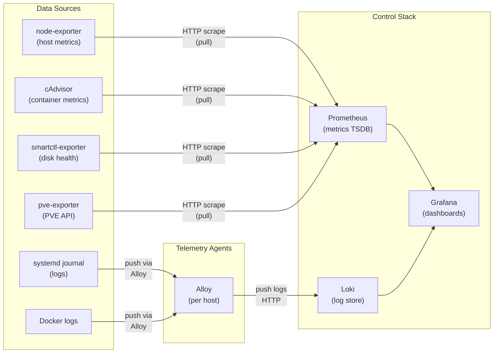

# Telemetry Pipeline

How metrics and logs flow from hosts to dashboards.

## Data Flow

## Two Models: Push vs Pull

| Signal | Model | Who initiates |
|--------|-------|--------------|
| Metrics | **Pull** — Prometheus scrapes exporters | Prometheus |
| Logs | **Push** — Alloy ships logs to Loki | Alloy agent |

This split is standard in the Prometheus ecosystem. Push for logs avoids the need for Prometheus
to open connections to every host; pull for metrics gives Prometheus full control over scrape
intervals and target health.

## Alloy's Role

Alloy is the glue. On each host it:
1. Reads from `systemd journal` (where `alloy_journal_enabled: true`)
2. Reads from Docker socket for container log streams
3. Labels log lines with `host`, `job`, `container` labels
4. Ships to Loki at `http://{{ control_host_ip }}:{{ loki_host_port }}/loki/api/v1/push`

## Current Gaps

- Prometheus doesn't scrape `monitoring-1` (B21) — see [[entities/prometheus]]
- Node compose missing journald volumes (B23) — see [[entities/alloy]]

## Related

- [[observability-pillars]] — where metrics and logs fit in the three-pillar model
- [[entities/alloy]], [[entities/prometheus]], [[entities/loki]]
