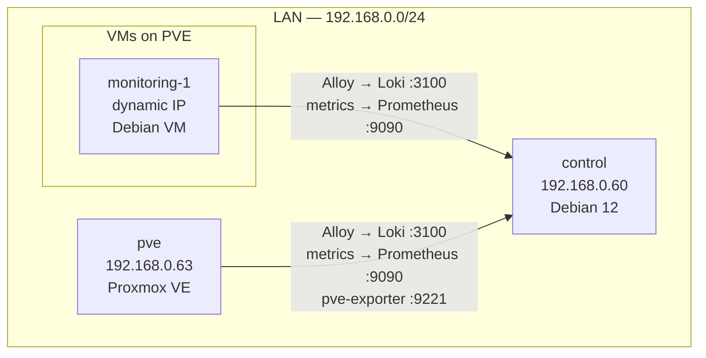
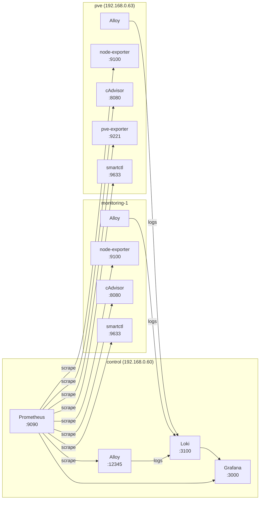
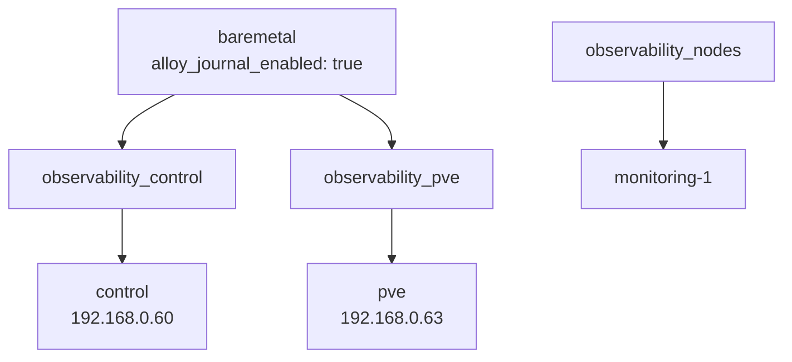

# Baucumlabs Homelab — Nexus

> [!info] What This Is
> A LAN-based homelab running a Docker Compose observability stack (Prometheus · Grafana · Loki · Alloy)
> deployed idempotently via Ansible across bare-metal Debian and Proxmox VE hosts.
> Goal: zero playbook edits when new VMs are provisioned — all configuration flows through roles and group_vars.

## Quick Facts

| | |
|--|--|
| **Control host** | `control` — 192.168.0.60 (Debian) |
| **Hypervisor** | `pve` — 192.168.0.63 (Proxmox VE) |
| **First VM node** | `monitoring-1` — dynamic IP (Debian VM on PVE) |
| **Observability services** | 9 (Prometheus, Grafana, Loki, Alloy, Dozzle, node-exporter, cAdvisor, smartctl-exporter, pve-exporter) |
| **Automation** | Ansible — `ansible/` directory, `milestone_1` branch |
| **Current milestone** | Milestone 1 — bug remediation, role scaffolding |

---

## Network Topology



---

## Telemetry Pipeline



---

## Ansible Inventory Hierarchy



---

## Host Inventory

![[network-inventory.base]]

---

## Service Map

![[services.base]]

---

## Navigation

### Infrastructure
- [[entities/control|control]] — Debian control host, full stack
- [[entities/pve|pve]] — Proxmox VE hypervisor
- [[entities/monitoring-1|monitoring-1]] — first VM node

### Services
- [[entities/prometheus|Prometheus]] · [[entities/grafana|Grafana]] · [[entities/loki|Loki]] · [[entities/alloy|Alloy]]
- [[entities/dozzle|Dozzle]] · [[entities/node-exporter|node-exporter]] · [[entities/cadvisor|cAdvisor]]
- [[entities/smartctl-exporter|smartctl-exporter]] · [[entities/pve-exporter|pve-exporter]]

### Architecture & Concepts
- [[concepts/idempotency|Idempotency]] · [[concepts/ansible-role-contracts|Role Contracts]]
- [[concepts/variable-hierarchy|Variable Hierarchy]] · [[concepts/telemetry-pipeline|Telemetry Pipeline]]
- [[concepts/handler-pattern-compose|Compose Handler Pattern]] · [[concepts/observability-pillars|Observability Pillars]]

### Retrospectives & Analysis
- [[synthesis/milestone-1-retrospective|Milestone 1 Retrospective]]
- [[synthesis/lessons-learned|Lessons Learned]]
- [[synthesis/security-posture|Security Posture]]
- [[synthesis/roadmap|Roadmap]]

### Resources
- [[sources/geerlingguy-ansible-for-devops|Ansible for DevOps]]
- [[sources/community-roles|Community Roles]]
- [[sources/official-docs|Official Docs]]
- [[comparisons/caddy-vs-traefik|Caddy vs Traefik]]
- [[comparisons/static-vs-dynamic-inventory|Static vs Dynamic Inventory]]

---

## Common Commands

```bash
# All commands run from ansible/

# Full stack deploy
ansible-playbook playbooks/site.yml --vault-id pve@playbooks/vault/pve.vault.txt

# Control node only
ansible-playbook playbooks/observability_control.yml --vault-id pve@playbooks/vault/pve.vault.txt

# Dry-run (check mode)
ansible-playbook playbooks/site.yml --vault-id pve@playbooks/vault/pve.vault.txt --check --diff

# Lint
ansible-lint playbooks/

# Encrypt a new variable
ansible-vault encrypt_string --vault-id pve@playbooks/vault/pve.vault.txt 'secret_value' --name 'var_name'

# Inventory shape check
ansible-inventory --list | python3 -m json.tool | head -60
```