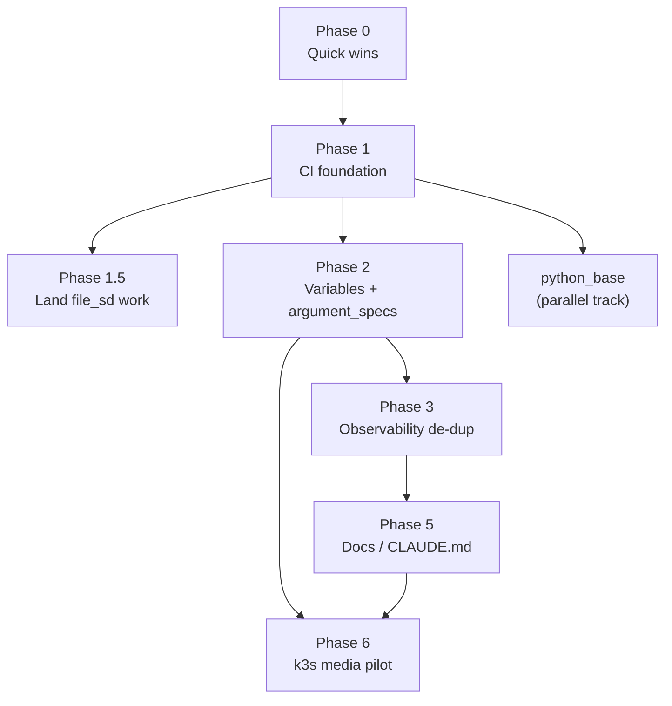

# Milestone 2: Hardening, CI, and Kubernetes Pilot

> [!info] What this is
> A forward-looking plan built after the Milestone 1 role migration landed. It sequences the structural work that makes the repo safe to change at speed (CI, a clean variable contract, de-duplicated roles), lays a proper Python foundation on the control node, and ends with a Kubernetes pilot for the media platform.
>
> This is distinct from the historical [[roadmap]] "Phase 1-5" list, which tracked Milestone 1 bug remediation. Where phase numbers overlap, the numbers here belong to Milestone 2.

> [!note] Guiding principles
> - **One validated change at a time.** A push that turns CI red costs trust. Prove each change with the repo's own checks before it lands.
> - **Abstraction is paid for with a pain signal you have actually felt.** We do not build for hypothetical scale. (This is why data-driven Compose was removed; see the end of this doc.)
> - **Ansible owns day-0/day-1, Terraform owns infra + app-config, orchestrators own day-2 apps.** Keep the boundaries clean.

---

## Competency map

Each phase is tagged with the SRE/DevOps competency it exercises, so the work doubles as demonstrable, explainable experience.

| Phase | Work | Competency it demonstrates |
|-------|------|----------------------------|
| 0 | Quick-win cleanup | Hygiene, reading a codebase critically |
| 1 | Pre-commit + GitHub Actions | CI/CD, shift-left testing, quality gates |
| 2 | Variable collapse + full `argument_specs` | Configuration management, interface contracts, variable precedence |
| 3 | De-duplicate observability roles | Reusable modules, DRY infrastructure |
| P | `python_base` (control node) | Environment/dependency management, PEP 668 literacy |
| 5 | Docs + `CLAUDE.md` rewrite | Documentation as a first-class deliverable, ADR discipline |
| 6 | Single-node k3s media pilot | Container orchestration, storage, GPU scheduling, GitOps |

---

## Dependency graph

---

## Phase 0 — Quick wins

**Goal:** clear known cruft so the Phase 1 lint baseline starts clean.

- Fix the `media_platform_sabnzdb_host_port` typo and drop the unused correctly-spelled default.
- `configarr` directory mode `0660` → `2775` (directories need the traversal bit).
- Delete the dead `playbooks/files/` tree and the triplicated dashboard copies in `roles/observability_node/files/`; keep one dashboard source in `roles/observability_control`.

**Demonstrates:** reading a codebase critically and reducing surface area before automating over it.
**Effort:** ~1 hour. **Depends on:** nothing.

---

## Phase 1 — CI foundation (priority)

**Goal:** two gates, one toolchain. Fast local feedback via pre-commit; an enforcement gate in GitHub Actions running the identical hooks, so a green local commit is a green CI run.

**Steps**
1. `.pre-commit-config.yaml`: hygiene hooks (`trailing-whitespace`, `end-of-file-fixer`, `check-yaml`, `detect-private-key`) + `yamllint` + `ansible-lint`, plus a SOPS guard so an unencrypted `*.sops.yml` can never be committed.
2. `.yamllint` and `ansible/.ansible-lint`: start at the `basic` or `moderate` profile with findings as warnings; get to zero errors; ratchet up one rung over time. Exclude `collections/`, `.ansible/`, and vendored `roles/geerlingguy.*`.
3. `.github/workflows/lint.yml`: run the same pre-commit hooks via `pre-commit/action`, install collections with `ansible-galaxy`, then a second job for `ansible-playbook … --syntax-check`.
4. Pin the runner Python to match the ansible-lint hook (avoids the "works local, fails CI" interpreter mismatch).
5. Fold in secrets-path portability: move the SOPS file in-repo so CI can parse the tree without an absolute symlink.

**Adoption:** run `pre-commit run --all-files` once for a baseline, triage (fix real bugs, `warn_list` the noise, `skip_list` with a reason for genuine rejects), reach zero errors, then turn on the gate.

**Docs**
- pre-commit framework: https://pre-commit.com/
- ansible-lint: https://ansible.readthedocs.io/projects/lint/
- ansible-lint profiles (the strictness ladder): https://ansible.readthedocs.io/projects/lint/profiles/
- yamllint: https://yamllint.readthedocs.io/
- GitHub Actions: https://docs.github.com/actions
- pre-commit GitHub action: https://github.com/pre-commit/action

**Demonstrates:** the single most-cited DevOps skill: automated quality gates and shift-left testing. Being able to explain the local/CI parity design is an interview answer on its own.
**Effort:** ~half a day. **Depends on:** Phase 0.

### Phase 1.5 — Land the file_sd Prometheus work

The `file_sd_configs` refactor (already prepared) lands right after CI so the new pipeline lints and syntax-checks it as its first real subject.

- Prometheus service discovery: https://prometheus.io/docs/prometheus/latest/configuration/configuration/#file_sd_config
- Why file_sd over static targets: https://prometheus.io/docs/guides/file-sd/

**Effort:** ~1 hour. **Depends on:** Phase 1.

---

## Phase 2 — Variable collapse + full argument_specs

**Goal:** one source of truth per value, enforced by a typed contract.

**Steps**
1. Remove the three-layer passthrough. Role defaults + `argument_specs` are the contract; inventory sets only deviations; genuinely shared facts live in `group_vars/all`. (Your intentional `hostvars` lookups stay.)
2. Complete `argument_specs.yml` for all roles (only 2 of 7 have one today, and those two are incomplete). Use the spec for what defaults cannot express:
   - `required: true` with **no default** for secrets, IPs, and disk devices.
   - `type` / `choices` everywhere; nested `options:` to validate lists-of-dicts (for example `lvm_storage_logical_volumes`, which replaces the empty-placeholder-defaults anti-pattern).
   - Keep the default value in one place only: `defaults/main.yml` for optionals, nowhere for requireds.

**Docs**
- Role argument validation: https://docs.ansible.com/ansible/latest/playbook_guide/playbooks_reuse_roles.html#role-argument-validation
- `validate_argument_spec` module: https://docs.ansible.com/ansible/latest/collections/ansible/builtin/validate_argument_spec_module.html
- Variable precedence: https://docs.ansible.com/ansible/latest/playbook_guide/playbooks_variables.html#variable-precedence-where-should-i-put-a-variable

**Demonstrates:** configuration management maturity and API/interface design. "I gave every role a validated contract" is exactly the language hiring managers listen for.
**Effort:** ~half a day to a day. **Depends on:** Phase 1 (CI catches variable-resolution breakage during the collapse). **Enables:** Phase 3.

---

## Phase 3 — De-duplicate the observability roles

**Goal:** one logical thing lives in one place.

`observability_control` and `observability_node` currently duplicate Dozzle, Alloy, Compose, and the dashboard trees. Merge into one role differentiated by which services a host enables (data in inventory), with a single dashboard source.

**Docs**
- Roles (reuse, defaults, dependencies): https://docs.ansible.com/ansible/latest/playbook_guide/playbooks_reuse_roles.html
- Ansible role best practices (Red Hat CoP): https://redhat-cop.github.io/automation-good-practices/

**Demonstrates:** building reusable modules and eliminating duplication, the DRY principle applied to infrastructure.
**Effort:** 1 to 2 days. **Depends on:** Phase 2 (needs the clean variable model first).

---

## python_base — control-node Python foundation (parallel track)

**Goal:** stop fighting PEP 668 and make the control node's Python legible. Three layers, three tools.

- **apt (system):** `python3-venv` (this provides `ensurepip`), `python3-pip`, `python3-dev`, `python3-setuptools`, `python3-wheel`, `pipx`.
- **pipx (dev CLIs):** `ansible`, `ansible-lint`, `pre-commit`. Each isolated on `PATH`.
- **venv (module runtime libs) + interpreter:** one venv holding `docker`, `proxmoxer`, `requests`; point `ansible_python_interpreter` for the control host at it. Drops the pip layer currently in `docker_base`.
- **Bootstrap:** a `Makefile`/`bootstrap.sh` handles the one-time chicken-and-egg (create venv, `pipx install`); the role keeps all three layers in sync afterward. Pin the venv with a `requirements-runtime.txt`.

**Decisions locked:** scope is control-node tooling; module deps go in a dedicated venv the interpreter points at.

**Docs**
- PEP 668 (externally-managed environments): https://peps.python.org/pep-0668/
- pipx: https://pipx.pypa.io/stable/
- Python venv: https://docs.python.org/3/library/venv.html
- Ansible `pip` module (with `virtualenv:`): https://docs.ansible.com/ansible/latest/collections/ansible/builtin/pip_module.html
- `community.general.pipx`: https://docs.ansible.com/ansible/latest/collections/community/general/pipx_module.html

**Demonstrates:** dependency isolation and environment management, plus current-Debian literacy (PEP 668 trips up a lot of people).
**Effort:** ~half a day. **Depends on:** Phase 1 (CI validates the new role).

---

## Phase 5 — Docs + CLAUDE.md rewrite

**Goal:** documentation that matches reality and points into the wiki instead of duplicating it.

- Rewrite `CLAUDE.md` to state the goal and the real Terraform + Ansible + SOPS architecture (the current file still describes the Milestone 1 inline-playbook world).
- Add a short "known structural debt" section.
- Record the Terraform-vs-configarr config-ownership boundary and the k8s decision as ADRs, using [[decision-record-template]].

**Docs**
- Diátaxis (a documentation framework worth knowing by name): https://diataxis.fr/

**Demonstrates:** treating docs and ADRs as deliverables. A repo that explains its own decisions reads as senior.
**Effort:** ~half a day. **Depends on:** Phases 2 to 3 landing (document the settled structure).

---

## Phase 6 — Single-node k3s media pilot

**Decisions locked:** k3s, single node, the whole media_platform stack including GPU Jellyfin, local storage on one filesystem, Helm-via-Ansible first then Flux later.

**Why these choices**
- **Local storage, one filesystem.** SABnzbd behaves badly on NFS (SQLite history, unpack churn), and hardlinks/atomic moves between SABnzbd and the arr apps require the download dir and the media library to share one filesystem. A single local volume (the LVM disk Terraform attaches to the node) holding downloads and library, mounted into every pod with a shared PUID/PGID and `UMASK 002`, resolves both. The `nfs_server` role stays dormant.
- **Helm-via-Ansible before Flux.** Learning k8s primitives, Helm, and GitOps at once is too much. Start by hand-writing a few manifests to learn the objects, adopt the `bjw-s app-template` chart per service, deploy via `kubernetes.core`, then graduate to Flux (which continues your SOPS model unchanged).

**How it maps onto `workspace/`**
- **Node:** reuse `modules/proxmox_vm` (`vm_count=1`, `pcie_devices` = transcoding GPU, media disk via `additional_disks`, a `k8s` tag). Terraform still owns VM birth.
- **Cluster:** Ansible installs single-node k3s on the tagged node over cloud-init SSH, via the existing Proxmox dynamic inventory.
- **Apps:** app-template releases deployed by Ansible; secrets from SOPS.
- **App config:** the `deployments/media/application` arr providers re-point at the cluster URL and keep working (`update.mechanism` becomes cosmetic).
- **GPU:** Terraform passthrough delivers the iGPU to the VM; the Intel device plugin (`gpu.intel.com/i915`) exposes `/dev/dri` to the Jellyfin pod.
- **Observability:** stays external; add kube-state-metrics + node-exporter and scrape via Kubernetes SD.

**Internal order:** TF node → Ansible k3s → local PV + test pod → device plugin + Jellyfin GPU proof → remaining services → arr Terraform re-point → observability scrape → cutover.

**Scope honesty:** a single node teaches objects, Helm, ingress, storage, secrets, and GPU scheduling. It does not teach multi-node scheduling, affinity, cross-node networking, or HA. Those live in a later Talos/multi-node cluster.

**Docs**
- k3s: https://docs.k3s.io/
- bjw-s app-template chart: https://bjw-s-labs.github.io/helm-charts/docs/app-template/
- `kubernetes.core` collection: https://docs.ansible.com/ansible/latest/collections/kubernetes/core/
- Flux (GitOps): https://fluxcd.io/flux/
- Flux + SOPS: https://fluxcd.io/flux/guides/mozilla-sops/
- Intel GPU device plugin: https://intel.github.io/intel-device-plugins-for-kubernetes/cmd/gpu_plugin/README.html
- Jellyfin Intel hardware acceleration: https://jellyfin.org/docs/general/post-install/transcoding/hardware-acceleration/intel/
- TRaSH Guides, hardlinks and atomic moves: https://trash-guides.info/File-and-Folder-Structure/Hardlinks-and-Instant-Moves/
- Kubernetes concepts (start here if new): https://kubernetes.io/docs/concepts/

**Demonstrates:** the headline competency. Container orchestration, persistent storage, device scheduling, and a credible GitOps trajectory, all wired into an existing IaC pipeline.
**Effort:** the largest item; a multi-session build. **Depends on:** Phase 2; Phase 5 for the ADR.

---

## Removed: data-driven Compose

A generic services-dict Compose renderer was considered and **removed**. The abstraction only pays off when several near-identical Compose stacks drift apart, which is not the current situation: the service set is small and fixed, the Compose is readable, and the parts that vary are already parameterized with vars. For a solo-maintained lab, a literal Compose you can eyeball beats a Jinja loop you must re-derive.

**Tripwire to revisit:** maintaining three or more Compose stacks that are ~80% identical, where the same fix lands in two and gets forgotten in the third. Until that pain is felt, building for it is speculative work. It is also moot for media, which is moving to k8s.

---

## How to talk about this work

The repo already combines Terraform (Proxmox provider, reusable module, arr app providers, Cloudflare DNS), Ansible (idempotent roles, `argument_specs`, handlers), SOPS shared across both tools, and a full observability stack. That is the SRE/DevOps stack. The gap being closed here is less about capability and more about the signals that read as production discipline: a CI gate, validated contracts, de-duplicated modules, ADRs, and an orchestration story. Each phase above is written so you can point at a commit and explain the decision behind it, which is what interviews actually probe.
