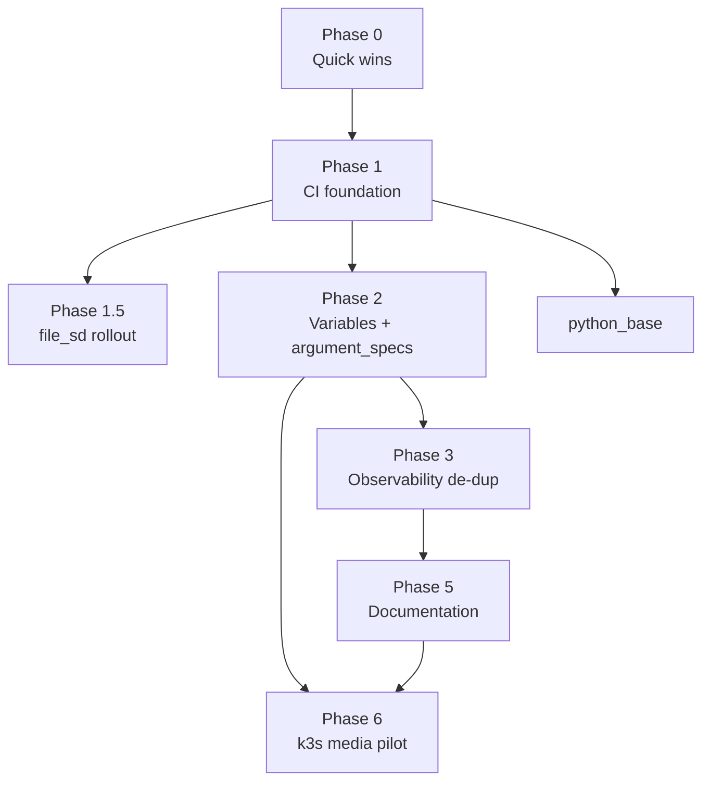

# Milestone 2: Hardening, CI, and Kubernetes Pilot

## Objective

Establish the controls and structure that make the repository safe to change at speed, then migrate the media platform to a single-node Kubernetes cluster. The milestone delivers, in order: a CI quality gate, a single-source variable model with validated role contracts, de-duplicated observability roles, a Python foundation for the control node, reconciled documentation, and a k3s pilot for the media stack.

This document supersedes no prior work. It follows the Milestone 1 role migration and is distinct from the historical [[roadmap]], whose "Phase 1-5" refer to Milestone 1. Phase numbers in this document belong to Milestone 2.

## Principles

- One validated change per push. Each change is proven with the repository's own checks before it lands.
- Abstraction requires an observed pain signal. Speculative generalization is out of scope.
- Tool boundaries are fixed: Terraform provisions infrastructure and application configuration, Ansible performs day-0/day-1 host configuration, orchestrators own day-2 application lifecycle.

## Scope

### In scope

- Pre-commit and GitHub Actions CI for the Ansible codebase.
- Collapse of the group_vars passthrough layer and completion of `argument_specs` across all roles.
- Consolidation of `observability_control` and `observability_node` into a single parameterized role.
- A `python_base` role and bootstrap for the control node.
- Rewrite of `CLAUDE.md` and creation of supporting ADRs.
- A single-node k3s pilot hosting the full media platform.

### Out of scope

- Data-driven Compose templating. See [Rejected work](#rejected-work).
- Multi-node or highly available Kubernetes.
- Migration of the observability stack to Kubernetes.
- Revival of the `nfs_server` / `nfs_client` roles.

## Locked decisions

| Area | Decision |
|------|----------|
| Kubernetes distribution | k3s |
| Cluster topology | Single node |
| Pilot workload | Full `media_platform` stack, including GPU Jellyfin |
| Cluster storage | Single local volume, one filesystem for downloads and library |
| Deployment model | Helm via `kubernetes.core`, with a later migration to Flux GitOps |
| `python_base` scope | Control node; module dependencies in a dedicated venv referenced by `ansible_python_interpreter` |
| Secrets | SOPS, shared across Terraform and Ansible, continued into Flux |

## Phase overview

| Phase | Title | Depends on | Estimate |
|-------|-------|------------|----------|
| 0 | Quick wins | none | 1h |
| 1 | CI foundation | 0 | 0.5d |
| 1.5 | file_sd rollout | 1 | 1h |
| 2 | Variable collapse + argument_specs | 1 | 0.5-1d |
| 3 | Observability role de-duplication | 2 | 1-2d |
| P | python_base | 1 | 0.5d |
| 5 | Documentation | 2, 3 | 0.5d |
| 6 | k3s media pilot | 2, 5 | multi-session |

---

## Phase 0 — Quick wins

**Objective.** Remove known defects and dead files so the Phase 1 lint baseline starts clean.

**Tasks.**
- Correct the `media_platform_sabnzdb_host_port` variable typo; remove the unused correctly-spelled default.
- Change `configarr` directory creation mode from `0660` to `2775`.
- Delete `playbooks/files/` and the duplicated dashboard trees under `roles/observability_node/files/`; retain a single dashboard source under `roles/observability_control`.

**Acceptance criteria.**
- No duplicate dashboard files remain across roles.
- `media_platform` variable references resolve to a single, correctly-named port variable.
- `git status` shows only intended deletions and edits.

---

## Phase 1 — CI foundation

**Objective.** Provide fast local feedback and an enforcement gate that runs the identical checks, so a passing local commit passes CI.

**Tasks.**
- Add `.pre-commit-config.yaml` with hygiene hooks (`trailing-whitespace`, `end-of-file-fixer`, `check-yaml`, `detect-private-key`), `yamllint`, `ansible-lint`, and a SOPS-encryption guard.
- Add `.yamllint` and `ansible/.ansible-lint` at the `basic` or `moderate` profile, findings as warnings initially. Exclude `collections/`, `.ansible/`, and vendored `roles/geerlingguy.*`.
- Add `.github/workflows/lint.yml`: run the pre-commit hooks, install collections via `ansible-galaxy`, and run `ansible-playbook --syntax-check`.
- Pin the CI runner Python to match the `ansible-lint` hook interpreter.
- Relocate the SOPS group_vars file into the repository to remove the absolute-path symlink dependency.

**Acceptance criteria.**
- `pre-commit run --all-files` completes with zero errors (warnings permitted).
- The GitHub Actions workflow passes on a pull request.
- No plaintext secret can be committed (guard hook rejects it).

**References.**
- pre-commit: https://pre-commit.com/
- ansible-lint: https://ansible.readthedocs.io/projects/lint/
- ansible-lint profiles: https://ansible.readthedocs.io/projects/lint/profiles/
- yamllint: https://yamllint.readthedocs.io/
- GitHub Actions: https://docs.github.com/actions
- pre-commit action: https://github.com/pre-commit/action

### Phase 1.5 — file_sd rollout

**Objective.** Land the prepared Prometheus `file_sd_configs` refactor under the new CI gate.

**Acceptance criteria.**
- Prometheus renders targets from inventory; adding a node requires no edit to `prometheus.yml`.
- The change passes lint and syntax-check.

**References.**
- file_sd configuration: https://prometheus.io/docs/prometheus/latest/configuration/configuration/#file_sd_config
- file_sd guide: https://prometheus.io/docs/guides/file-sd/

---

## Phase 2 — Variable collapse and argument_specs

**Objective.** One source of truth per value, enforced by a typed role contract.

**Tasks.**
- Remove the three-layer group_vars passthrough. Role defaults and `argument_specs` form the contract; inventory sets only deviations; shared facts live in `group_vars/all`. Intentional `hostvars` lookups are retained.
- Author complete `argument_specs.yml` for all roles:
  - `required: true` with no default for secrets, host addresses, and disk devices.
  - `type` and `choices` on all options; nested `options:` for lists of dictionaries (for example `lvm_storage_logical_volumes`).
  - Default values defined once, in `defaults/main.yml` for optional variables.

**Acceptance criteria.**
- Each of the seven roles has an `argument_specs.yml` covering every input.
- A missing required variable fails at role entry with a named error.
- No value is defined in more than one location.

**References.**
- Role argument validation: https://docs.ansible.com/ansible/latest/playbook_guide/playbooks_reuse_roles.html#role-argument-validation
- Variable precedence: https://docs.ansible.com/ansible/latest/playbook_guide/playbooks_variables.html#variable-precedence-where-should-i-put-a-variable

---

## Phase 3 — Observability role de-duplication

**Objective.** Consolidate the duplicated `observability_control` and `observability_node` roles into one role differentiated by enabled services.

**Tasks.**
- Merge the shared task files (Dozzle, Alloy, Compose) and templates into a single role.
- Drive control-versus-node behavior from inventory data rather than two role copies.
- Maintain a single dashboard source.

**Acceptance criteria.**
- Each service is defined once.
- Control and node hosts converge from the same role with differing variables.
- No functional regression versus the two-role deployment.

**References.**
- Roles: https://docs.ansible.com/ansible/latest/playbook_guide/playbooks_reuse_roles.html
- Ansible good practices: https://redhat-cop.github.io/automation-good-practices/

---

## python_base — Control-node Python foundation

**Objective.** Provide a PEP 668 compliant Python layout on the control node.

**Tasks.**
- apt layer: `python3-venv`, `python3-pip`, `python3-dev`, `python3-setuptools`, `python3-wheel`, `pipx`.
- pipx layer: `ansible`, `ansible-lint`, `pre-commit`.
- venv layer: a dedicated virtual environment holding `docker`, `proxmoxer`, `requests`; set `ansible_python_interpreter` for the control host to it. Remove the pip installation currently performed by `docker_base`.
- Provide a `Makefile` or `bootstrap.sh` for the one-time creation of the venv and pipx tools; the role maintains all three layers on subsequent runs. Pin the venv with `requirements-runtime.txt`.

**Acceptance criteria.**
- No system-wide pip installation occurs; PEP 668 is not triggered.
- `community.docker` modules resolve their dependencies from the venv.
- The bootstrap is reproducible from a clean control node.

**References.**
- PEP 668: https://peps.python.org/pep-0668/
- pipx: https://pipx.pypa.io/stable/
- venv: https://docs.python.org/3/library/venv.html
- Ansible pip module: https://docs.ansible.com/ansible/latest/collections/ansible/builtin/pip_module.html
- community.general.pipx: https://docs.ansible.com/ansible/latest/collections/community/general/pipx_module.html

---

## Phase 5 — Documentation

**Objective.** Align documentation with the current Terraform + Ansible + SOPS architecture.

**Tasks.**
- Rewrite `CLAUDE.md` to describe the current architecture and role-based layout, replacing the Milestone 1 inline-playbook description.
- Add a "known structural debt" section.
- Record the Terraform-versus-configarr configuration-ownership boundary and the Kubernetes pilot decision as ADRs using [[decision-record-template]].

**Acceptance criteria.**
- `CLAUDE.md` contains no reference to superseded structure.
- Two ADRs exist and are linked from the index.

**References.**
- Diátaxis documentation framework: https://diataxis.fr/

---

## Phase 6 — Single-node k3s media pilot

**Objective.** Migrate the full media platform to a single-node k3s cluster provisioned by the existing Terraform module.

**Design constraints.**
- Storage: a single local volume holds downloads (incomplete and complete) and the media library on one filesystem, mounted into all pods with a shared PUID/PGID and `UMASK 002`. This satisfies SABnzbd's incompatibility with NFS and the hardlink/atomic-move requirement between the download client and the arr applications.
- Deployment: raw manifests for initial learning, then the `bjw-s app-template` chart per service, deployed via `kubernetes.core`. Migration to Flux GitOps is a later step and reuses SOPS.
- GPU: Terraform passes the iGPU to the node VM; the Intel GPU device plugin advertises `gpu.intel.com/i915` and exposes `/dev/dri` to the Jellyfin pod.

**Tasks (ordered).**
1. Provision the node with `modules/proxmox_vm` (`vm_count=1`, `pcie_devices` for the transcoding GPU, media disk via `additional_disks`, `k8s` tag).
2. Install single-node k3s with an Ansible role, targeting the tagged node via the Proxmox dynamic inventory.
3. Configure the local PersistentVolume and validate with a test pod.
4. Install the Intel GPU device plugin; validate Jellyfin hardware transcoding.
5. Deploy the remaining services via the app-template chart.
6. Re-point the `deployments/media/application` arr providers at the cluster endpoint.
7. Add kube-state-metrics and node-exporter; scrape from the existing external Prometheus via Kubernetes service discovery.
8. Cut over from the Docker media VM.

**Acceptance criteria.**
- All media services run in-cluster and are reachable.
- Jellyfin performs hardware transcoding using the iGPU.
- SABnzbd imports to the arr applications complete as instant hardlinks.
- The external Prometheus scrapes cluster metrics.
- The Terraform application layer manages arr configuration against the cluster.

**Non-goals.** Multi-node scheduling, affinity, cross-node networking, and high availability are explicitly deferred to a future multi-node cluster.

**References.**
- k3s: https://docs.k3s.io/
- bjw-s app-template: https://bjw-s-labs.github.io/helm-charts/docs/app-template/
- kubernetes.core: https://docs.ansible.com/ansible/latest/collections/kubernetes/core/
- Flux: https://fluxcd.io/flux/
- Flux with SOPS: https://fluxcd.io/flux/guides/mozilla-sops/
- Intel GPU device plugin: https://intel.github.io/intel-device-plugins-for-kubernetes/cmd/gpu_plugin/README.html
- Jellyfin Intel hardware acceleration: https://jellyfin.org/docs/general/post-install/transcoding/hardware-acceleration/intel/
- TRaSH Guides, hardlinks and atomic moves: https://trash-guides.info/File-and-Folder-Structure/Hardlinks-and-Instant-Moves/
- Kubernetes concepts: https://kubernetes.io/docs/concepts/

---

## Rejected work

**Data-driven Compose.** A generic services-dictionary Compose renderer was evaluated and rejected. The service set is small and fixed, the Compose files are readable, and varying values are already parameterized. The abstraction is justified only when multiple near-identical Compose stacks drift apart, which is not the current condition. The media stack, the largest Compose consumer, is migrating to Kubernetes, where the app-template chart provides parameterization.

Revisit condition: three or more Compose stacks that are approximately 80 percent identical, where a fix applied to some is omitted from others.

## Definition of done

- Phases 0 through 3 and `python_base` complete, with CI green on the default branch.
- `CLAUDE.md` and the two ADRs reflect the current architecture.
- The media platform runs on the k3s pilot with GPU transcoding, hardlink imports, and external metrics scraping.
